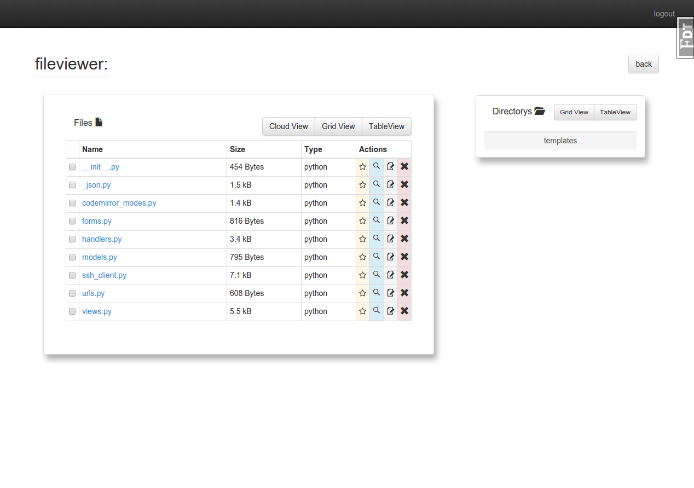
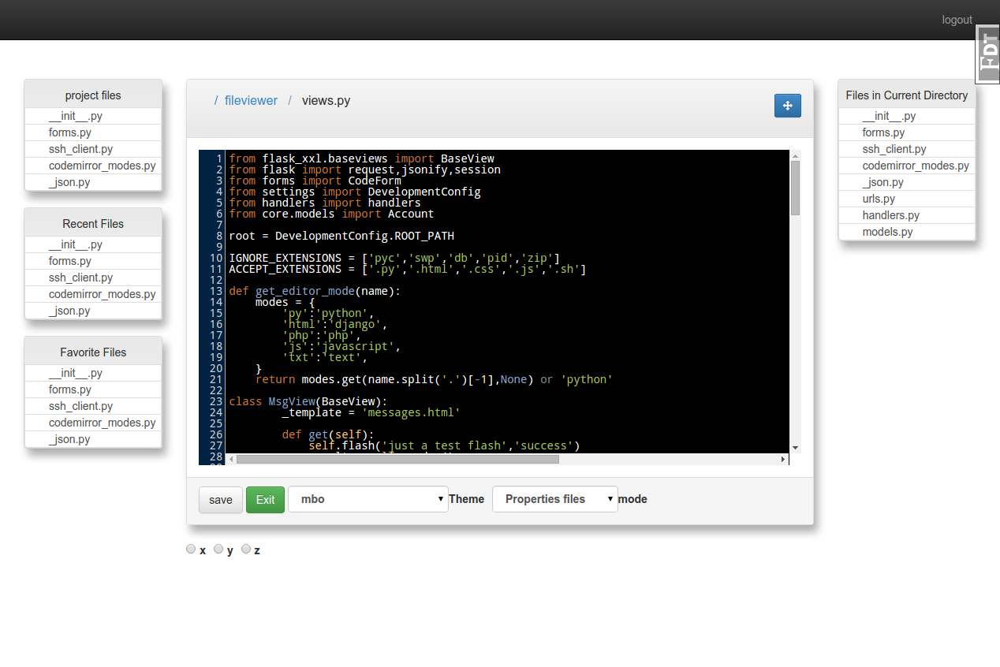

##Flask-Ide
####A Full Featured in browser IDE 

#####SSH Support (planned)
#####Support for multiple login accounts and base directorys per SSH server (planned)

i now have a live [demo](http://flask-ide-readonly.herokuapp.com/view_files) running in readonly mode,check it out. 

in the demo:

* to open a file click its name
* to just view the contents of a file click the magnifying glass icon in the files row

* features for the other icons (star,pencil,x) have not been implemented yet

currently only actully supports editing files local to flask-ide's install, but full local filesystem editing will be added soon, and so will connecting to servers via ssh. keep checking back 

if you can get it working, this is the inteface

the filesystem viewer

  

and the editor (built on top of flask-codemirror)

